# Java Trace/Span Analysis Report

Generated on: 2025-08-03 17:26:08

**Validation Score**: 100

**Validation Status**: pass

**Message**: Found 0 observability issues.

## Code Structure Summary
The provided code appears to represent a backend application, likely part of a web application framework such as Spring Boot. It involves a series of operations related to user login, product management, and category management, interacting with a MySQL database. Below is a high-level analysis:

### 1. High-Level Call Graph / Component Interaction Summary:

- **Application Initialization**: 
  - `SpringApplication.run(JtSpringProjectApplication, args)`: Starts the Spring Boot application.

- **User Management**:
  - **Login**: Validates user credentials against the database and manages session state.
  - **Profile Management**: Retrieves and updates user profile information, including username, email, password, and address.
  - **Registration**: Inserts new user data into the database.

- **Admin Management**:
  - **Admin Login**: Validates admin credentials and manages admin session state.
  - **Category Management**: 
    - Add, update, and delete categories in the database.
  - **Product Management**: 
    - Add, update, and delete products in the database.
    - Retrieve product details for display or update.

- **Database Operations**:
  - Utilizes JDBC for database connectivity and operations.
  - Performs SQL queries for CRUD operations on tables like `users`, `categories`, and `products`.

### 2. Important Classes and Their Roles:

- **`SpringApplication`**: 
  - A Spring Boot class responsible for launching the application.

- **`DriverManager`**:
  - Manages database connections using JDBC.

- **`Connection`**:
  - Represents a connection to the database, allowing for the execution of SQL statements.

- **`Statement` & `PreparedStatement`**:
  - Execute SQL queries and updates. `PreparedStatement` is used for parameterized queries to prevent SQL injection.

- **`ResultSet`**:
  - Represents the result set of a query, used to iterate over returned database records.

- **`Model`** (implied in `addAttribute`):
  - Likely part of a web framework (e.g., Spring MVC), used to pass data to views.

- **Variables**:
  - `usernameforclass`, `adminlogcheck`: Manage user and admin session states.
  - `username`, `password`, `email`, `address`: User-related fields for login and profile management.
  - `catname`, `categoryname`, `id`: Category-related fields for management.
  - `pname`, `pdescription`, `pimage`, `pprice`, etc.: Product-related fields for management.

The code involves significant database interaction, primarily for authentication and CRUD operations on user, category, and product data. It also includes basic error handling using try-catch blocks for database operations.

## Call Graph (From AST)

```mermaid
graph TD
    main --> run
    index --> equalsIgnoreCase
    index --> addAttribute
    userlogin --> forName
    userlogin --> getConnection
    userlogin --> createStatement
    userlogin --> executeQuery
    userlogin --> next
    userlogin --> getString
    userlogin --> addAttribute
    userlogin --> println
    adminlogin --> equalsIgnoreCase
    adminlogin --> equalsIgnoreCase
    adminlogin --> addAttribute
    addcategorytodb --> forName
    addcategorytodb --> getConnection
    addcategorytodb --> createStatement
    addcategorytodb --> prepareStatement
    addcategorytodb --> setString
    addcategorytodb --> executeUpdate
    addcategorytodb --> println
    removeCategoryDb --> forName
    removeCategoryDb --> getConnection
    removeCategoryDb --> createStatement
    removeCategoryDb --> prepareStatement
    removeCategoryDb --> setInt
    removeCategoryDb --> executeUpdate
    removeCategoryDb --> println
    updateCategoryDb --> forName
    updateCategoryDb --> getConnection
    updateCategoryDb --> createStatement
    updateCategoryDb --> prepareStatement
    updateCategoryDb --> setString
    updateCategoryDb --> setInt
    updateCategoryDb --> executeUpdate
    updateCategoryDb --> println
    updateproduct --> forName
    updateproduct --> getConnection
    updateproduct --> createStatement
    updateproduct --> createStatement
    updateproduct --> executeQuery
    updateproduct --> next
    updateproduct --> getInt
    updateproduct --> getString
    updateproduct --> getString
    updateproduct --> getInt
    updateproduct --> getInt
    updateproduct --> getInt
    updateproduct --> getInt
    updateproduct --> getString
    updateproduct --> addAttribute
    updateproduct --> addAttribute
    updateproduct --> addAttribute
    updateproduct --> executeQuery
    updateproduct --> next
    updateproduct --> addAttribute
    updateproduct --> getString
    updateproduct --> addAttribute
    updateproduct --> addAttribute
    updateproduct --> addAttribute
    updateproduct --> addAttribute
    updateproduct --> println
    updateproducttodb --> forName
    updateproducttodb --> getConnection
    updateproducttodb --> prepareStatement
    updateproducttodb --> setString
    updateproducttodb --> setString
    updateproducttodb --> setInt
    updateproducttodb --> setInt
    updateproducttodb --> setInt
    updateproducttodb --> setString
    updateproducttodb --> setInt
    updateproducttodb --> executeUpdate
    updateproducttodb --> println
    removeProductDb --> forName
    removeProductDb --> getConnection
    removeProductDb --> prepareStatement
    removeProductDb --> setInt
    removeProductDb --> executeUpdate
    removeProductDb --> println
    addproducttodb --> getConnection
    addproducttodb --> createStatement
    addproducttodb --> executeQuery
    addproducttodb --> next
    addproducttodb --> getInt
    addproducttodb --> prepareStatement
    addproducttodb --> setString
    addproducttodb --> setString
    addproducttodb --> setInt
    addproducttodb --> setInt
    addproducttodb --> setInt
    addproducttodb --> setInt
    addproducttodb --> setString
    addproducttodb --> executeUpdate
    addproducttodb --> println
    profileDisplay --> forName
    profileDisplay --> getConnection
    profileDisplay --> createStatement
    profileDisplay --> executeQuery
    profileDisplay --> next
    profileDisplay --> getInt
    profileDisplay --> getString
    profileDisplay --> getString
    profileDisplay --> getString
    profileDisplay --> getString
    profileDisplay --> addAttribute
    profileDisplay --> addAttribute
    profileDisplay --> addAttribute
    profileDisplay --> addAttribute
    profileDisplay --> addAttribute
    profileDisplay --> println
    profileDisplay --> println
    updateUserProfile --> forName
    updateUserProfile --> getConnection
    updateUserProfile --> prepareStatement
    updateUserProfile --> setString
    updateUserProfile --> setString
    updateUserProfile --> setString
    updateUserProfile --> setString
    updateUserProfile --> setInt
    updateUserProfile --> executeUpdate
    updateUserProfile --> println
    newUseRegister --> getConnection
    newUseRegister --> prepareStatement
    newUseRegister --> setString
    newUseRegister --> setString
    newUseRegister --> setString
    newUseRegister --> executeUpdate
    newUseRegister --> println
    newUseRegister --> println
```

## File: /var/folders/g3/txb1dl0x4z3bdc5gsswf3sw40000gn/T/tmpl8w0yuyp/JtProject/src/test/java/com/jtspringproject/JtSpringProject/JtSpringProjectApplicationTests.java
## File: /var/folders/g3/txb1dl0x4z3bdc5gsswf3sw40000gn/T/tmpl8w0yuyp/JtProject/src/main/java/com/jtspringproject/JtSpringProject/JtSpringProjectApplication.java
## File: /var/folders/g3/txb1dl0x4z3bdc5gsswf3sw40000gn/T/tmpl8w0yuyp/JtProject/src/main/java/com/jtspringproject/JtSpringProject/controller/AdminController.java
## File: /var/folders/g3/txb1dl0x4z3bdc5gsswf3sw40000gn/T/tmpl8w0yuyp/JtProject/src/main/java/com/jtspringproject/JtSpringProject/controller/UserController.java
